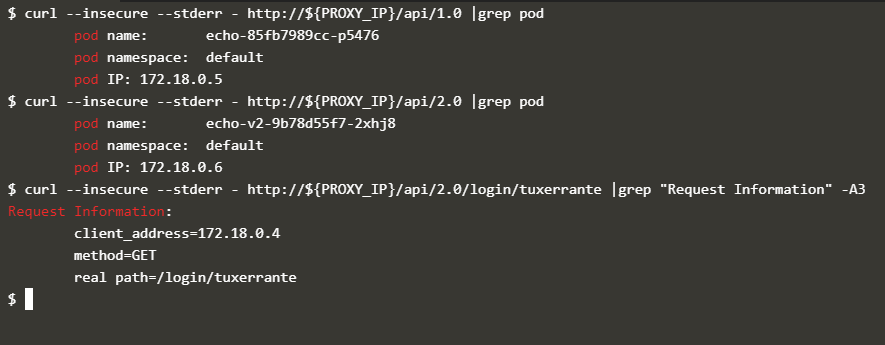

<iframe src="https://ghbtns.com/github-btn.html?user=twbs&repo=bootstrap&type=star&count=true&size=large" frameborder="0" scrolling="0" width="170" height="30" title="GitHub"></iframe>
  <iframe src="https://ghbtns.com/github-btn.html?user=twbs&repo=bootstrap&type=fork&count=true&size=large" frameborder="0" scrolling="0" width="170" height="30" title="GitHub"></iframe>

# README
This should be a fast start to understand and use an api gateway on kubernetes leveraging the Kong ingress.

## KONG INGRESS CONTROLLER
Kong Gateway is an open-source, lightweight API gateway optimized for microservices, delivering unparalleled latency, performance, and scalability.

## What the script does:

- Installs [Kong ingress controller](https://docs.konghq.com/kubernetes-ingress-controller/1.1.x/guides/overview/) 
- Installs the [echo server](https://gcr.io/kubernetes-e2e-test-images/echoserver:2.2) with relative service
- Modify the metadata of the echo server to install it again as a version 2.0
- Update the ingress to route the requests to different APIs to the different services
- Use 'uri-rewrites' to delete the "api" part from the invoked URI, before sending the request to the endpoint app. [[docs]](https://docs.konghq.com/kubernetes-ingress-controller/1.1.x/guides/using-rewrites/)

## Action
The best way to use the code is to read the comments and to copy-paste the instructions from `install_echo_apis.sh`, understanding what is going on under the hoods, this is also why I have added some extra monitoring command.

If you don't have a K8S cluster available you can use the [Katacoda environment](https://www.katacoda.com/courses/kubernetes/kubectl-run-containers) or install [minikube](https://minikube.sigs.k8s.io/docs/start/) on your machine.

1. Go on your preferred environment. Katacoda some times gets stuck, so don't rely on that terminal state.. ;)
2. Star and fork this repo :)
3. Clone your forked repo on the machine
3. `cd kubernetes_kong_api_management/`
3. Since this is a didactical repo, it has no meaning to do a blind-run script.
    So it is better to copy paste a command at a time.
  
A preview of how the ingress can *eat* the "api" part of the URI, so to be transparent to the backend endpoint clusters.

## Sources
- [The echo server app](gcr.io/kubernetes-e2e-test-images/echoserver:2.2)
- https://docs.konghq.com/kubernetes-ingress-controller/1.1.x/introduction/
- https://github.com/Kong/kubernetes-ingress-controller

## Next Actions
- [Rate limiting](https://docs.konghq.com/kubernetes-ingress-controller/1.1.x/guides/redis-rate-limiting/)
- [Preserve client IP address when Kong is behind a load balancer](https://docs.konghq.com/kubernetes-ingress-controller/1.1.x/guides/preserve-client-ip/)

